# Workshop 1: Use Power Platform Pipelines for Solution Deployments

## Workshop Pre-requisites  
- Three Power Platform environments to create a pipeline.  
- Identify the host, development, and target environments.  

  | Development | UAT       | PROD      | HOST      |
  |------------|----------|----------|----------|
  | CPPS DEV   | CPPS UAT | CPPS PROD | CPPS PROD |

- All environments used in pipelines must have a Microsoft Dataverse database.  
- You must have a **Power Platform administrator** or **Dataverse system administrator** role to install the pipelines application.  
- The target environments used in the pipeline must be enabled as [Managed Environments](https://learn.microsoft.com/en-us/power-platform/admin/managed-environment-overview).  
- Environment IDs of the development and target environments. More info: [Find your environment and organization ID](https://learn.microsoft.com/power-platform/admin/environments-overview).  

## Introduction  
- **Deployment Pipeline Configuration App** – A Power Platform tool that automates and manages deployments across environments like Development, Test, and Production. It streamlines ALM processes, supports version control, and integrates with Power Platform Pipelines for efficient solution deployment.  
- **Host Environment** – A special-purpose environment that acts as the storage and management plane for all pipeline configuration, security, and run history.  
- **Development Environment** – The environment where solutions are developed. Pipelines can be run from any linked development environment.  
- **Target Environment** – The destination environment where a pipeline deploys solutions, such as **UAT** or **Production**.  

## Workshop Solution  
📥 **Download the [solution file](LabSolution/ALMSolution_1_0_0_0.zip) and save it on your local machine.**  

---

## Lab Instructions  

### 1️⃣ Import Workshop Solution to Your Development Environment  
1. Sign in to [Power Apps](https://make.powerapps.com).
2. Select the **development environment (CPPS DEV)** from the prerequisites.
3. Navigate to **Solutions**, then select **Import**.
   
4. On the **Import a solution** page, click **Browse** and select the solution file downloaded earlier.
   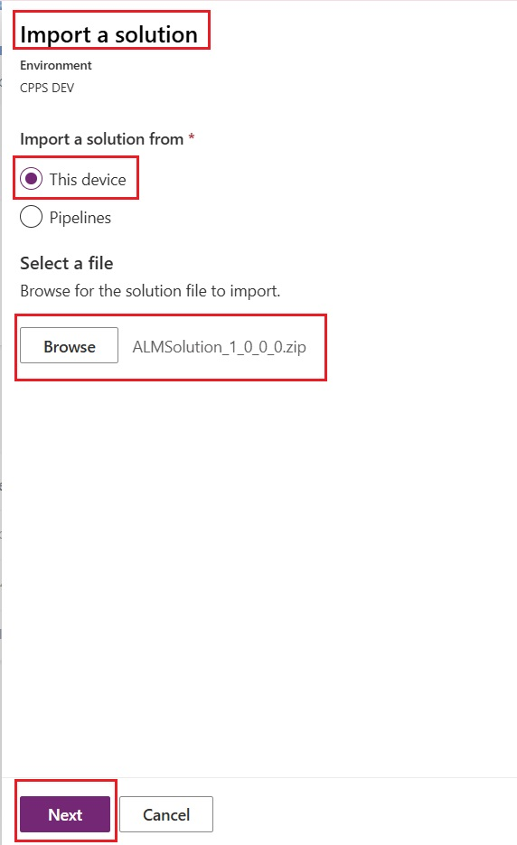  
5. Click **Next**, leave default settings, and select **Import**.

⏳ *Solution import may take a few moments.*  

---

### 2️⃣ Install Pipelines Application in Your Host Environment  
1. Sign in to the [Power Platform Admin Center](https://admin.powerplatform.microsoft.com).  
2. Select **Manage > Dynamics 365 apps**.
   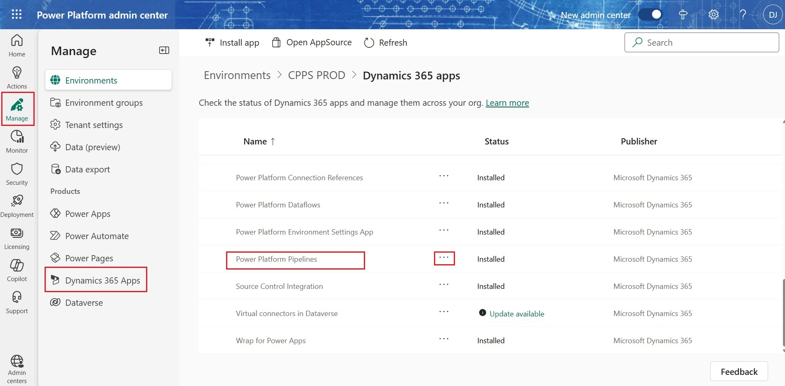
3. Scroll down to find **Power Platform Pipelines**.  
4. Click the **three dots** next to the app and select **Install**.
   
5. Select the **host environment (CPPS PROD)** from the prerequisites.
   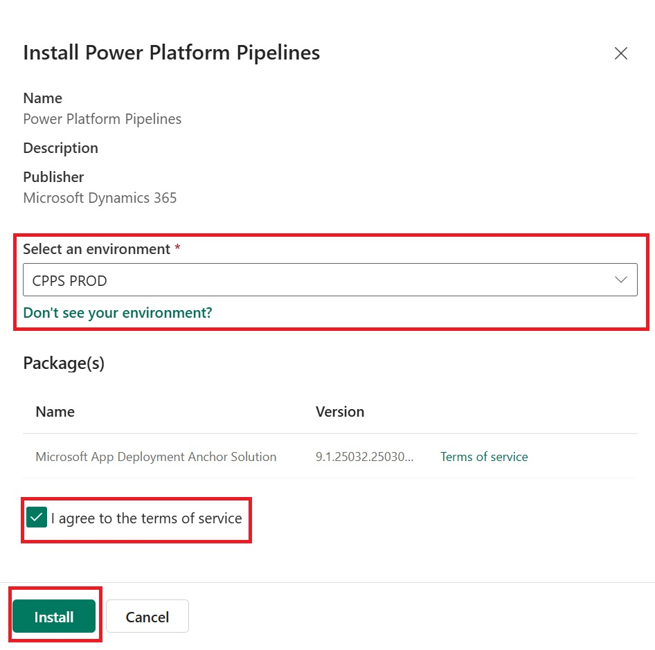
6. Agree to the terms and select **Install**.  

✅ *Once installed, the deployment pipelines configuration app appears in the list of installed apps.*  

---

### 3️⃣ Set Up Deployment Environments for the Pipeline  
1. Once the **Deployment Pipeline** package is installed in the **host environment**, go to **Apps** and open **Deployment Pipeline Configuration**.
   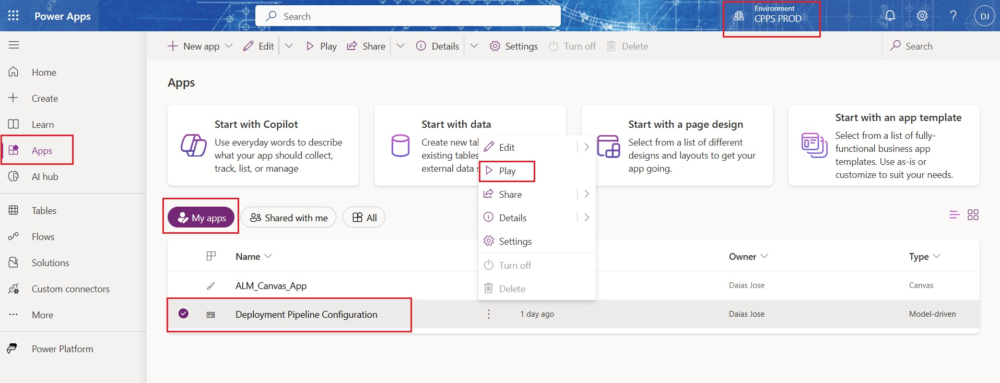
   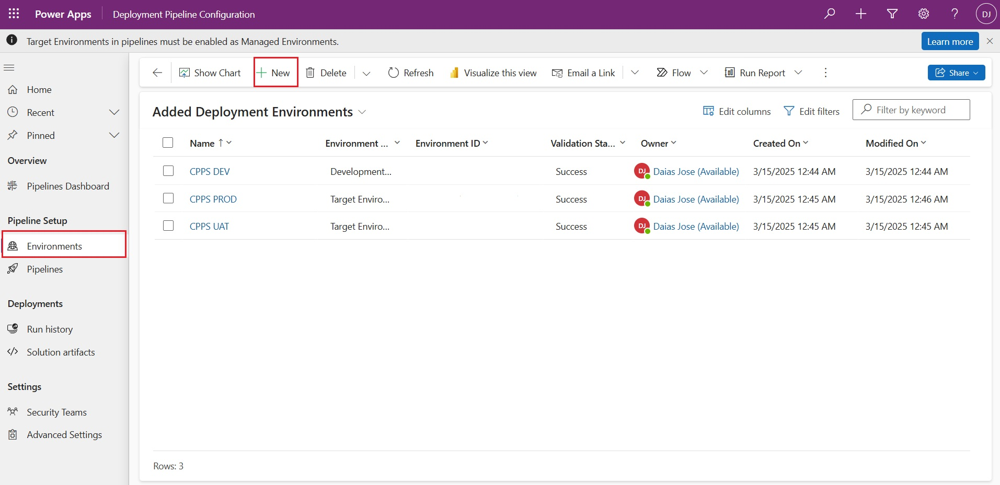
2. Select **Environments** > **New** to create environment records in Dataverse:
   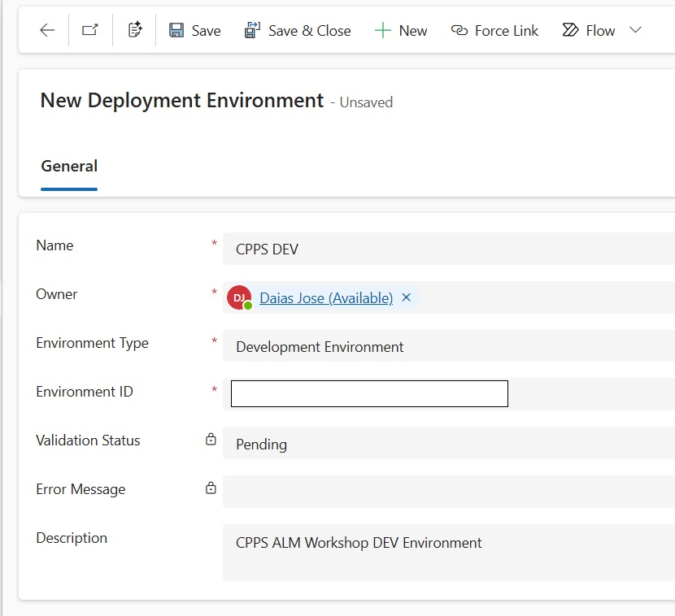
   - **Name**: (e.g., CPPS DEV)  
   - **Environment Type**: Select **Development Environment** for source, **Target Environment** for targets  
   - **Environment ID**: Enter the correct ID  
   - **Description**: Optional
   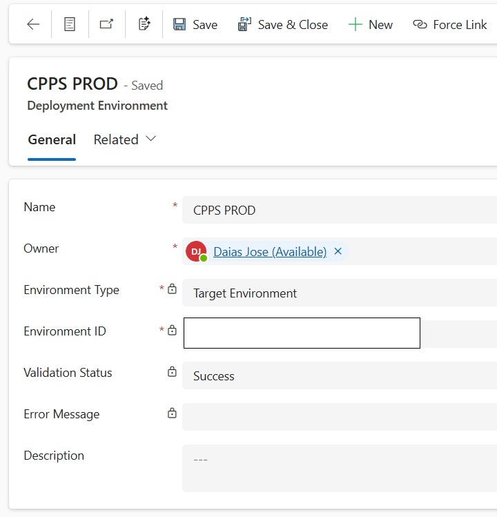
3. Click **Save**.  
4. Refresh the form and verify that **Validation Status = Success**.  
5. Repeat steps 2-4 for all three environments **CPPS DEV, CPPS UAT, CPPS PROD**.
    

---

### 4️⃣ Configure the Deployment Pipeline  
1. In the **Deployment Pipeline Configuration** app, go to **Pipelines** > **New**:
   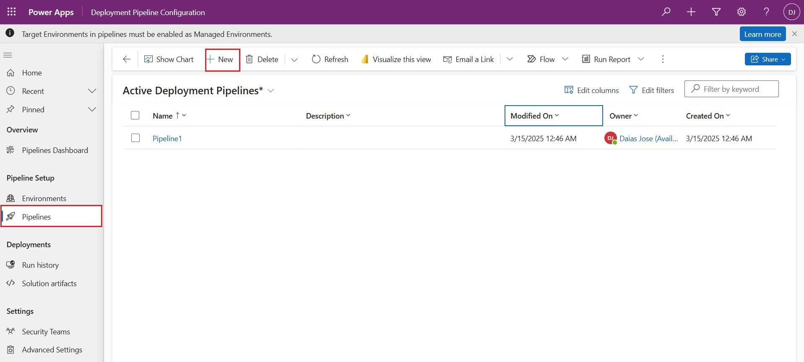
   - **Name**: My First Custom Pipeline  
   - **Description**: CPPS 2025 ALM workshop
   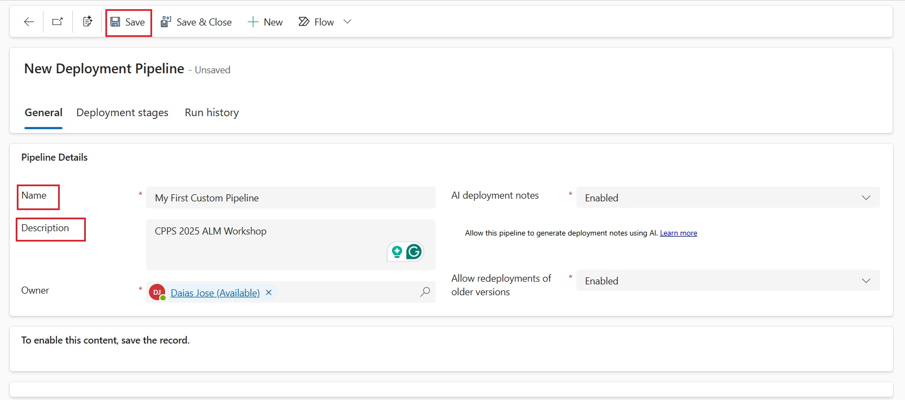
2. Click **Save**.  
3. In the **Linked Development Environments** section, click **Add Existing Development Environment** and select **CPPS DEV**.
   
   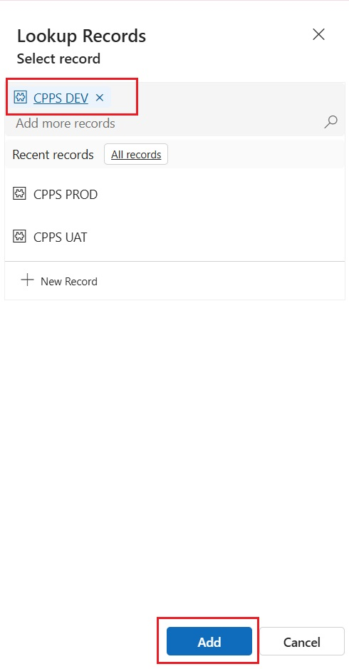
4. In **Deployment Stages**, click **New Deployment Stage**:
   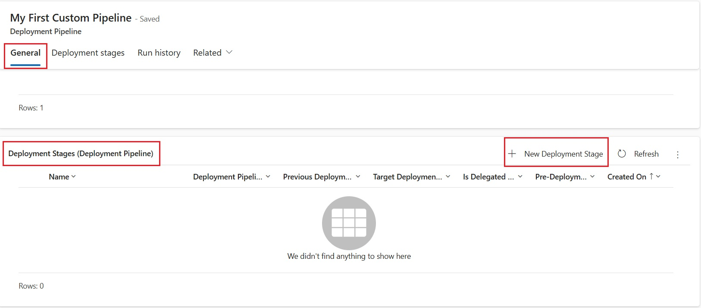
   - **Name**: Deploy to UAT Environment  
   - **Description**: Deploy solution to UAT  
   - **Target Deployment Environment ID**: Select **CPPS UAT**  
   - Click **Save & Close**.
   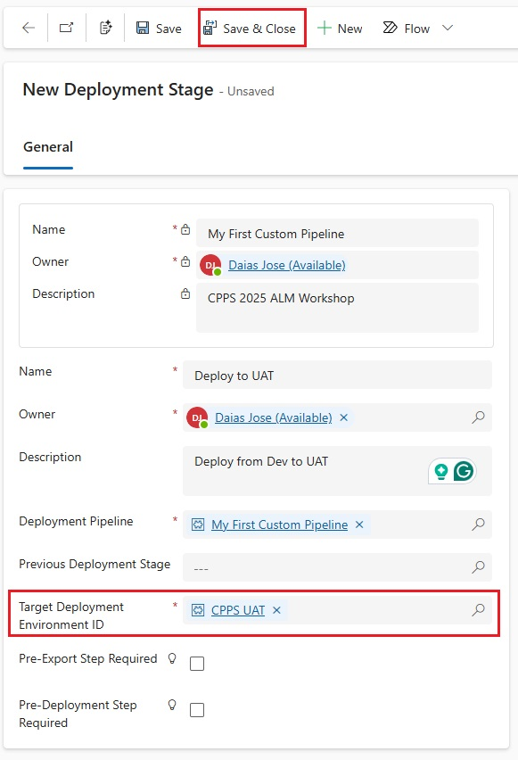  
5. Add another **New Deployment Stage**:  
   - **Name**: Deploy to PROD Environment  
   - **Description**: Deploy solution to PROD  
   - **Previous Deployment Stage**: Select **Deploy to UAT**  
   - **Target Deployment Environment ID**: Select **CPPS PROD**  
   - **Pre-Deployment Step Required**: ✅ (for approval setup)  
   - Click **Save & Close**.
   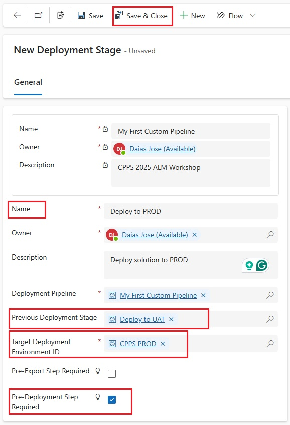
   

---

### 5️⃣ Create Deployment Approvals Using Power Automate  
1. Open [Power Automate](https://make.powerautomate.com) and select the **host environment**.  
2. Go to **Solutions** > **New Solution**.  
3. Enter the following details and click **Create**:  
   - **Display Name**: Pipeline Extension Flows  
   - **Name**: (leave as-is)  
   - **Publisher**: Select from the list
   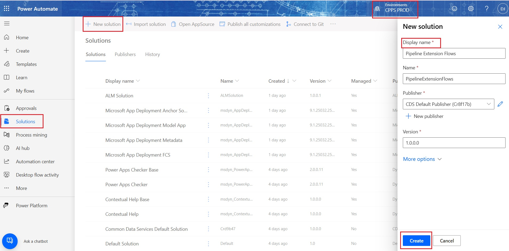 
4. Inside the solution, click **New > Automation > Cloud Flow > Automated**.
   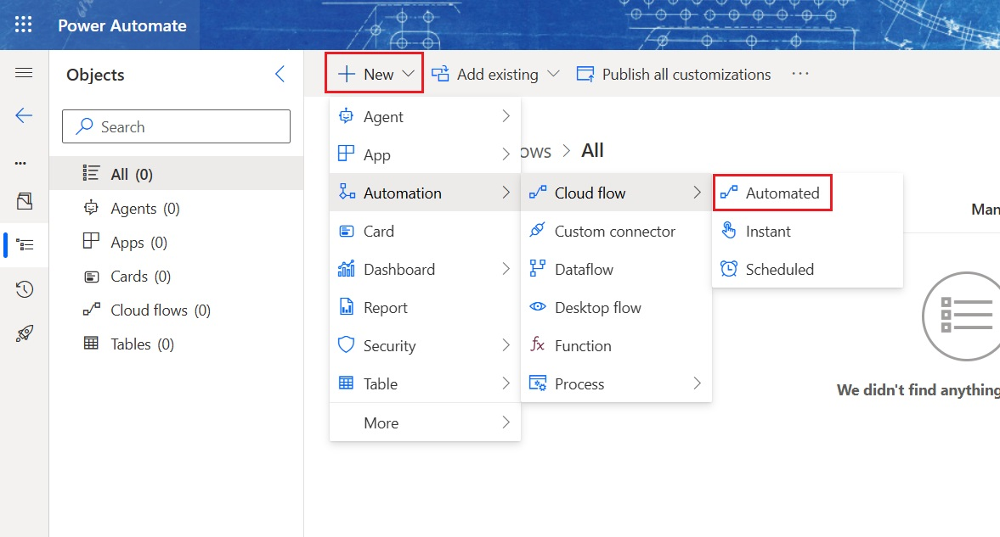
5. Name the flow **Pre-Deployment Approval Flow** and select **Create**.
   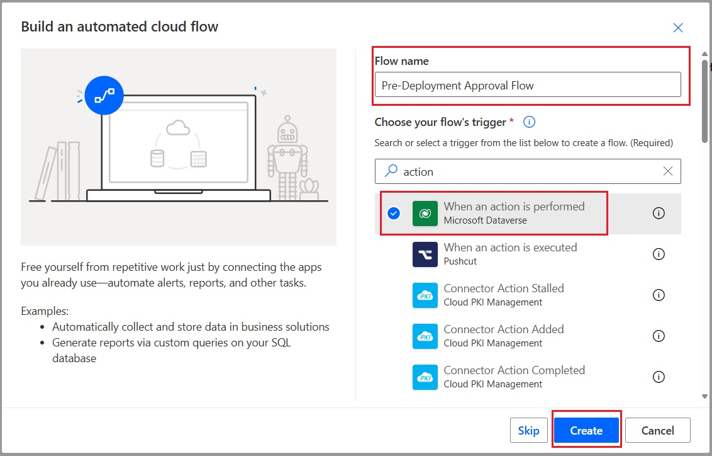  
6. Configure the **When an action is performed** trigger:  
   - **Catalog**: Microsoft Dataverse Common  
   - **Category**: Power Platform Pipelines  
   - **Action Name**: OnPreDeploymentStarted
   - **Trigger Condition**: @equals(triggerOutputs()?['body/OutputParameters/DeploymentPipelineName'], 'My First Custom Pipeline')
   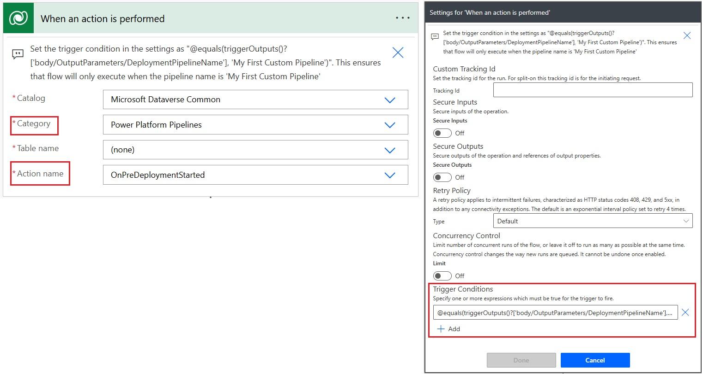
7. Click **New Step** and add **Start and wait for an approval**:  
   - **Approval Type**: Approve/Reject – Everyone must approve  
   - **Title**: Approve Deployment  
   - **Assigned To**: (your email)  
8. Click **New Step > Condition**.  
9. Configure the condition to proceed with deployment if approved -Outcome equals Approve.   
10. If outcome is **Approve**, click **New Step** to call the unbound action 'UpdatePreDeploymentStepStatus'.
   - **Action Name**: UpdatePreDeploymentStepStatus
   - **Item/StageRunID**: Add Dynamic content **ActionInputs StageRunID
   - **PreDeploymentStepStatus**:20
11. If outcome is not equal to **Approve**, click **New Step** to call the unbound action 'UpdatePreDeploymentStepStatus'.
   - **Action Name**: UpdatePreDeploymentStepStatus
   - **Item/StageRunID**: Add Dynamic content **ActionInputs StageRunID
   - **PreDeploymentStepStatus**:30
   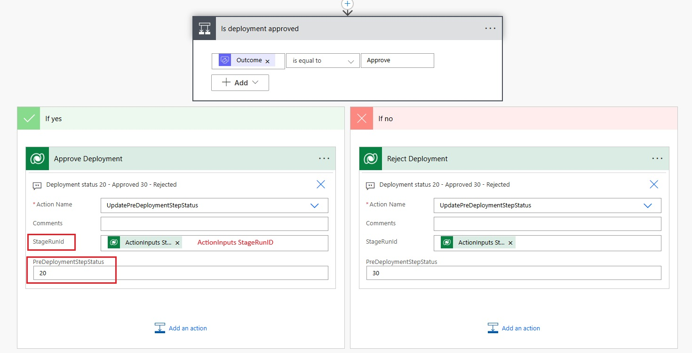 
12. Click **Save** to save the flow. 

---

### 6️⃣ Run the Pipeline  
1. Navigate to your development environment (CPPS DEV) and go to **Solutions**.
2. Select the solution imported in Step 1.  
3. Select **Overview** from the left navigation pane.  
4. Choose **My First Custom Pipeline**.  
5. Select **Deploy to UAT**, then **Deploy here**.
   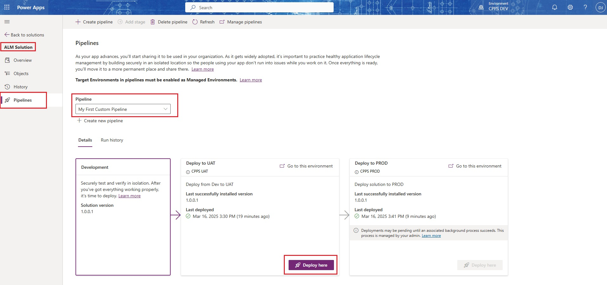 
6. Review the summary and select **Deploy**.
   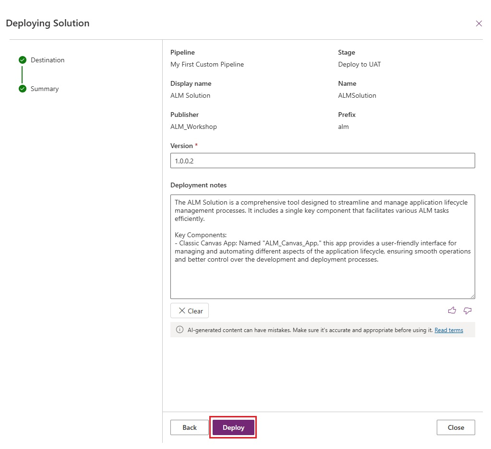 
7. After deployment to UAT, select **Deploy to PROD**.
   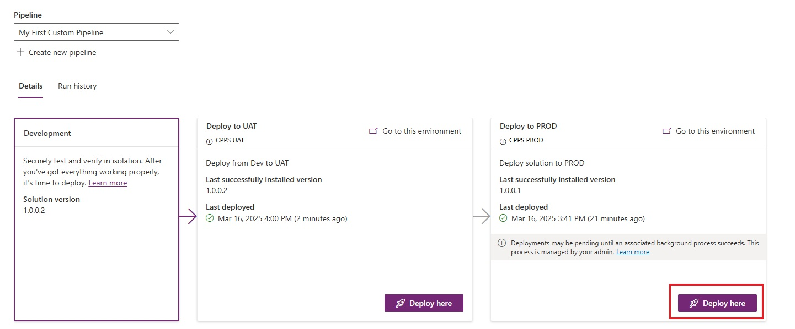 
8. Approve the request in **MS Teams/Outlook**.
   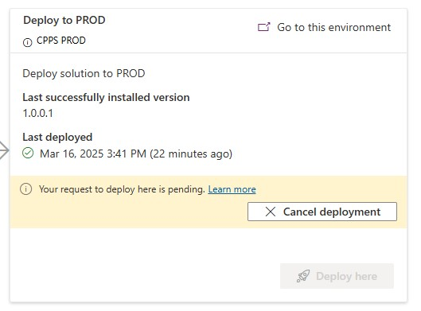 
10. Once deployment to the target environment finishes, review the run histories in **Deployment Pipeline Configuration**.
   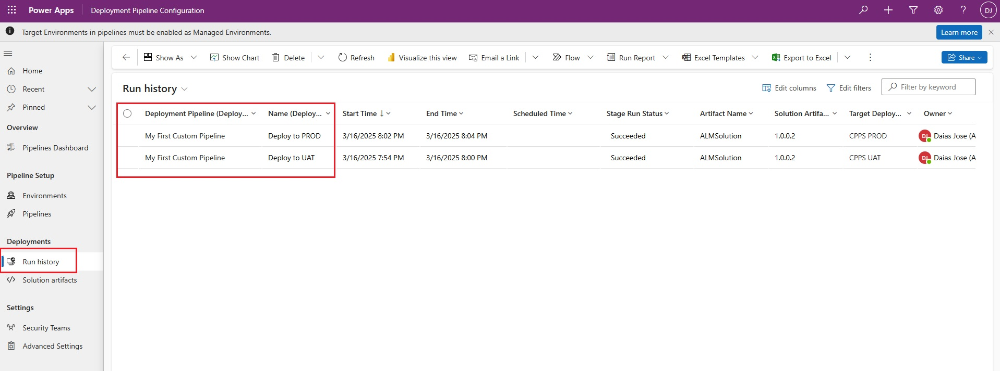 

---

## 🚀 Summary  
✅ Installed **Power Platform Pipelines**  
✅ Configured **Deployment Environments**  
✅ Created a **Deployment Pipeline**  
✅ Implemented **Approval Workflows** with **Power Automate**  
✅ Ran **Pipeline** to deploy solutions  

Happy building! 🎯🚀  
