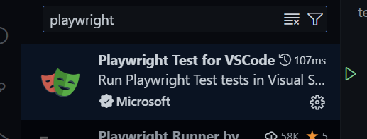
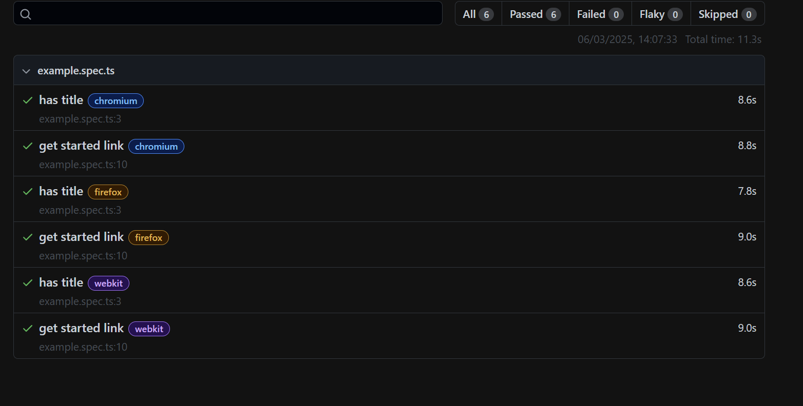

# Intro

Automated testing is a vital component for larger projects, where multiple developers are creating solutions in multiple streams, ensuring quality and essentially not breaking what has gone before adds a confidence in the delivery process.

Triggering automated test scripts as part of the build process reduces manual efforts and greatly reduces the impact of change to projects of any size.

Power Apps comes with the Power Apps Test Studio, but it is limited (currently) to testing Canvas Apps. This is a great starting point if you are only worried about canvas apps.

Playwright is an open source framework, created by Microsoft to allow testing across multiple browsers and websites, and will work for Model Driven apps, first party apps (such as Customer Service and Field Service), Canvas Apps and Power Pages. It is ideal if your solution spans multiple parts of the platform.

1. Using Power Apps Test Studio
    1. Create a test script in Test Studio
2. Using Playwright
   1. Install Playwright

Open the Extensions Window (Ctrl + Shift + X)

Search for Playwright and select Playwright Test for VSCode

 Withing VSCode create a new Window (Ctrl + Shift + N) and create a new folder (Ctrl + K, Ctrl + O) called TestScripts

 Install the Playwright Extension for VSCode

 

 Once installed, open Commands (Ctrl + Shift + P) and type Test and run the command Test>: Install Playwright

 

In the menu, select all 3 browsers, leave Use Javascript blank (we want to use the default Typescript) and add the Github Actions workflow checkbox filled


This will create a sample test script in your new folder and allow you to run the sample test scripts.

````npm
 npx playwright run
 ````

 This should run 6 tests using 6 workers as defined in the example.spec.ts file

 

 Once returned, take a look at the results

 ```npx
 npx playwright show-report
 ```

 This will display a webpage with the results for you to dissect.

 

   2. Configure MFA for Playwright

For the Power Platform, you usually log in and use Multi-factor Authentication (MFA) to secure your account, and this is becoming the default. As Playwright can not interact with your secondary device, the authenticator app on your phone, we have to do a little work around (suitable for POC, but for your real-life projects, you should use a dedicated test account, with very limited access to your dev system)

For our lab, we will be adding a Timed One Time Passcode method, which will mimic getting a code from your authenticator. 

Navigate to https://mysignins.microsoft.com/security-info in the browser you have been connecting to Power Platform with.

Select the Add sign-in method button.

Choose Microsoft Authenticator

Select I want to use a different authenticator app

Select Next

Select Can't scan image

Copy and keep safe the Secret Key, you will need this later.

Open your authenticator app on your phone and scan the QR code.

Click Next

Enter the code from your authenticator app and click Next.

This should now appear as another authenticator in your list.

> [!WARNING]
> Enusre you remove this authenticator when you are done. Whilst you need the secret, it should not be an option.

> All these secrets and passwords are passed as plain text in our lab, in a production and alm scenarios, these will be kept within a key vault to ensure they are not shared.


   3. Install a dummy solution 
   4. Create a test script
   5. Change your solution and run the script


3. Configuring DevOps
bb7mmn7skc6rn752